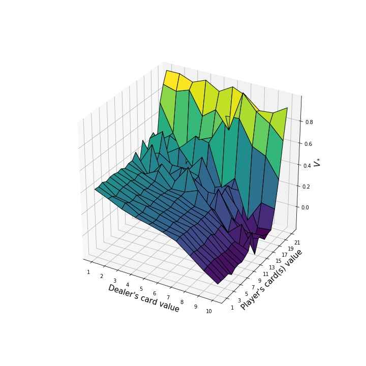
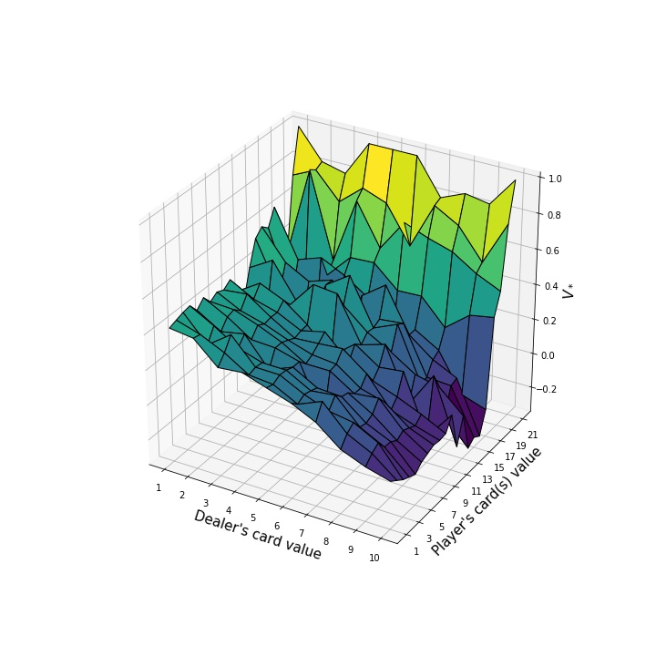
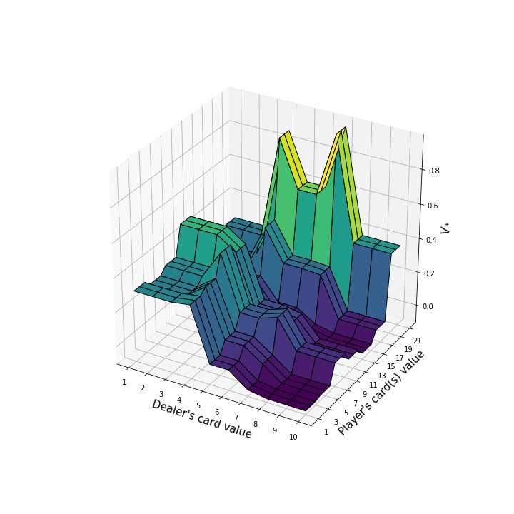

# Easy21 assignment

My solutions to the Easy21 assignment (simplified blackjack) assignement from David Silver's reinforecement learning course. The problem can be found here: http://www0.cs.ucl.ac.uk/staff/d.silver/web/Teaching_files/Easy21-Johannes.pdf

### MC result

### SARSA(lambda) result

### Linear approximation result

